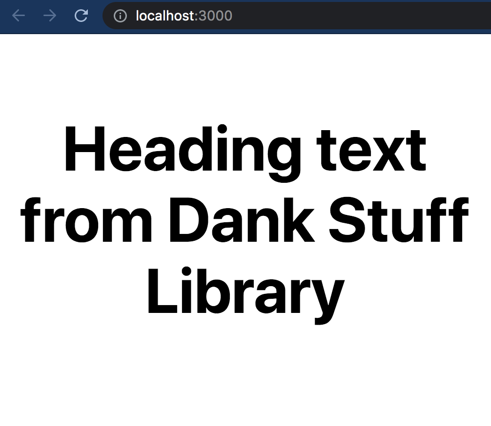
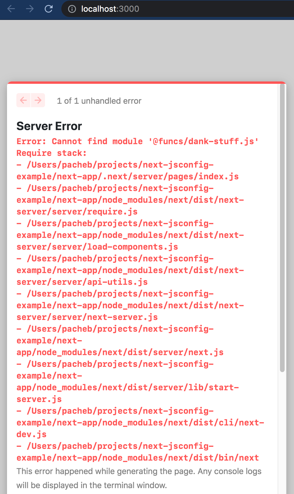
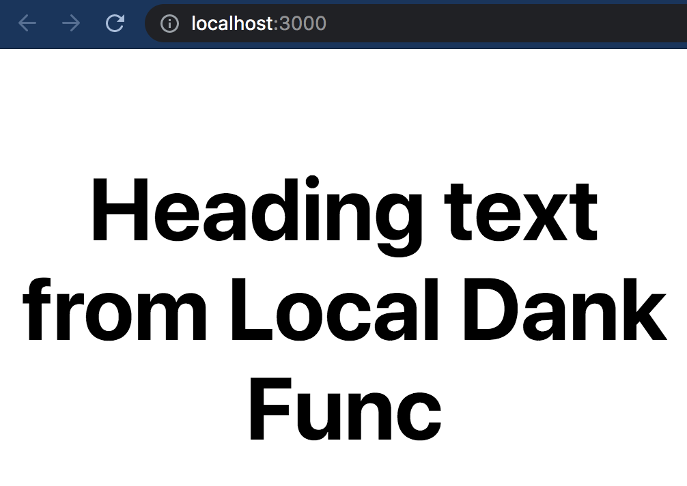
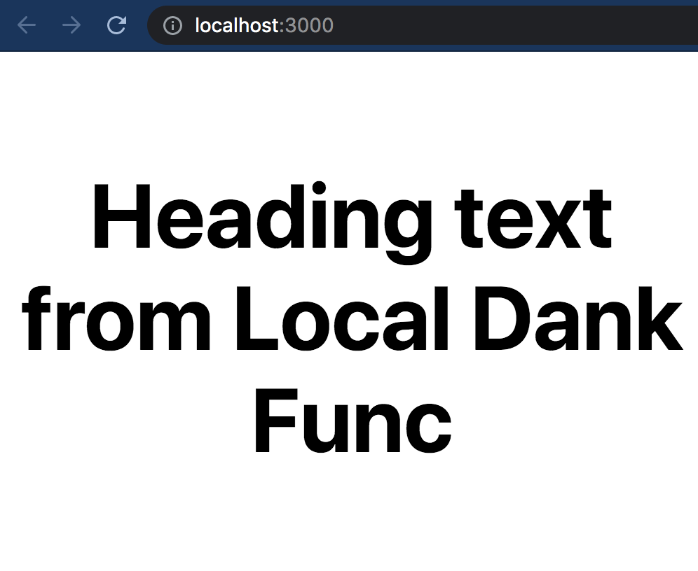

# Instructions

### Install library dependencies

```bash
cd dank-stuff && npm i && cd ..
```

### Install Next.js app dependencies

```bash
cd next-app && npm i
```

## Dependency from node_modules package

### Run `dev` with webpack 4

```bash
npm run dev:webpack4
```

Visit [http://localhost:3000/](http://localhost:3000/) - works as expected 🎉



### Run `dev` with webpack 5

```bash
npm run dev:webpack5
```

Visit [http://localhost:3000/](http://localhost:3000/) - Error: Cannot find module '@funcs/dank-stuff.js' ❌


## Override function from node_modules package with local function

**Rename `next-app/funcs/dank-stuff.rename-me.js` -> `next-app/funcs/dank-stuff.js`**

### Run `dev` with webpack 4

```bash
npm run dev:webpack4
```

Visit [http://localhost:3000/](http://localhost:3000/) - works as expected 🎉


### Run `dev` with webpack 5

```bash
npm run dev:webpack5
```

Visit [http://localhost:3000/](http://localhost:3000/) - works as expected 🎉

